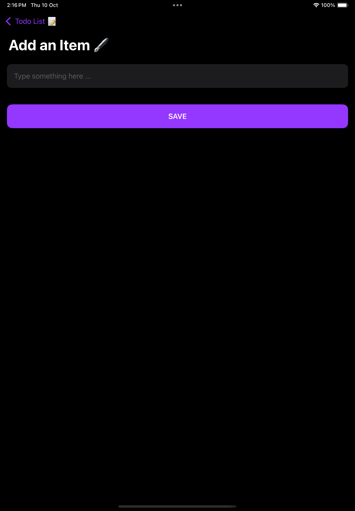

# DoSuffs

A simple iOS app built with **Swift** and **SwiftUI**, following the **MVVM architecture**. The app offers **CRUD (Create, Read, Update, Delete)** functionalities and uses **UserDefaults** and **EnvironmentObject** to manage data. The launch screen was designed using **Storyboard**.

## Features
- Add, update, and delete tasks
- Data persistence using `UserDefaults`
- Uses `EnvironmentObject` for state management
- MVVM architecture for clean and scalable code
- Designed for both **iPhone** and **iPad**

## Screenshots

### iPhone Screens
   
   
 

### iPad Screens
   

## Technologies Used
- **Swift** for native iOS development
- **SwiftUI** for the UI layer
- **Storyboard** for the launch screen
- **MVVM (Model-View-ViewModel)** architecture
- **UserDefaults** for local data storage
- **EnvironmentObject** for state management

## Usage
1. Launch the app on your iPhone or iPad.
2. Add, edit, move ,and delete tasks with ease.
3. The app will save your tasks locally using **UserDefaults** so that they persist between sessions.
